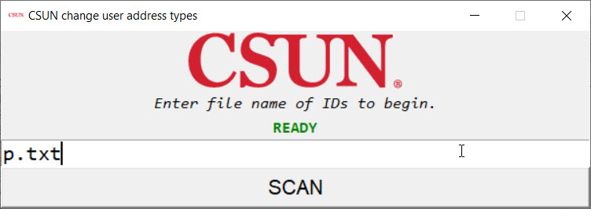
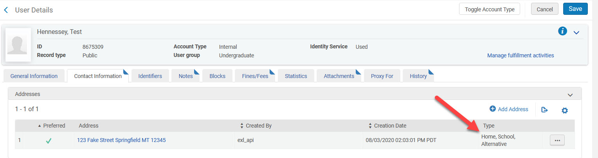
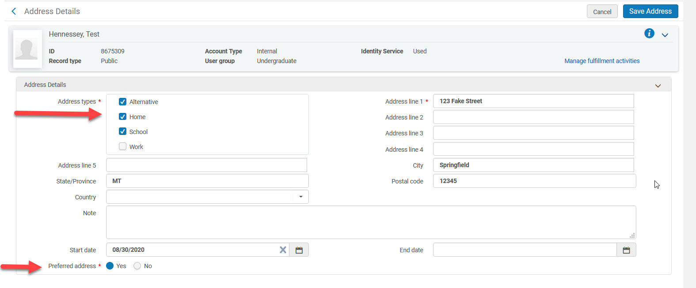

# alma-add-home-address-type-to-preferred
To get around a problem with Alma home delivery, add the home address type to preferred address records if it is not there.

Replace api_key in the config.ini with your API key that allows: User-Production-Read/Write. If you are not familiar with how to create an API Key for Ex Libris' Alma, you can read more about it here: https://developers.exlibrisgroup.com/alma/apis/

This program works on a plain text file of primary user IDs, each on a separate line. The file must be in the directory where you are running the code.

An error file named "error.txt" is written to the same directory where you run the code. Errors with particular IDs will not stop the program. Errors may look like this:

<i>User 12345 had this error: Mandatory field is missing: user_role parameters [ServiceUnit] for role number 214
  
User 54321 had this error: Request cannot contain two identifiers with the same value (types are: primary_id, BARCODE, value is 567567567).</i>

Any records that have the 'home' address type missing in the preferred address will have that type added to the preferred address. The user history will indicate that the record was updated by "exl_api". Other non-preferred addresses in the same record will not be updated. If "home" already exists in the preferred address record, the record will be skipped and nothing will be written. 

Lots of print messages are sent to the console if you would like to see the XML for the user record addresses.

Known errors: 
1. If you replace a user record that has associated roles that did not require a service unit before but need one now, you will get errors when re-writing the user record to Alma. Edit the user record roles in Alma until the user record allows you to re-rewrite it. Good candidates to check for a missing service unit: Work Order Operator, Receiving Operator, Receiving Operator Limited

2. The file with the IDs must be in the current directory you are working in.

3. If you update the same record several times, it seems to move the "start date" of the address earlier by one day each time you re-add it. This really only comes up during testing when you are re-adding the same record and would not happen in real life.

This program is based on this code presented at ELUNA Developer's Day Workshop by Jeremy Hobbs, linked here: https://github.com/MrJeremyHobbs/ELUNA-2019-Dev-Days-Alma-Course

Requirements: Python 3.x, modules: tkinter, requests, xmltodict

Questions, comments, changes? Contact Christina Hennessey, Systems Librarian at California State University, Northridge christina.hennessey@csun.edu

