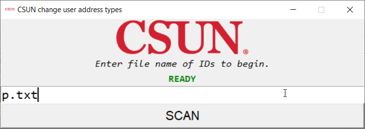

# alma-add-home-address-type-to-preferred
To get around a problem with Alma home delivery, add the home address type to preferred address records if it is not there.

Replace api_key in the config.ini with your API key that allows: User-Production-Read/Write.

Known errors: 
1. If you replace a user record that has associated roles that did not require a service unit before but need one now, you will get errors when re-writing the user record to Alma. Edit the user record roles in Alma until the user record allows you to re-rewrite it. Good candidates to check for a missing service unit: Work Order Operator, Receiving Operator, Receiving Operator Limited

This program is based on this code presented at ELUNA Developer's Day Workshop by Jeremy Hobbs, linked here: https://github.com/MrJeremyHobbs/ELUNA-2019-Dev-Days-Alma-Course

Requirements: Python 3.x, modules: requests, xmltodict

Questions, comments, changes? Contact Christina Hennessey, Systems Librarian at California State University, Northridge christina.hennessey@csun.edu

